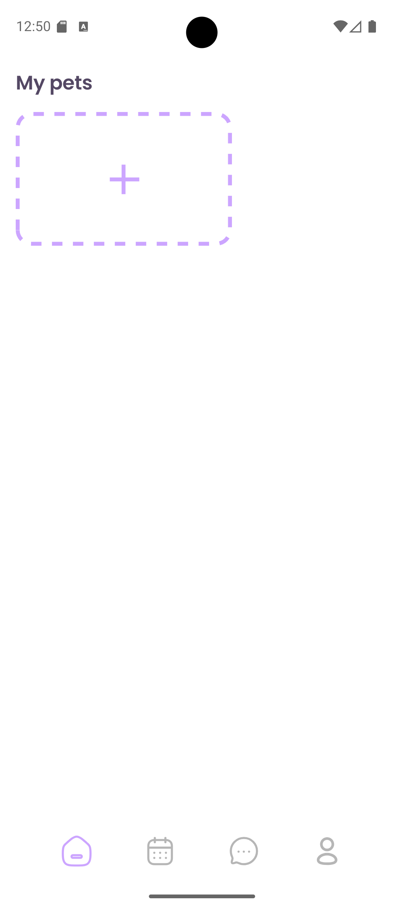
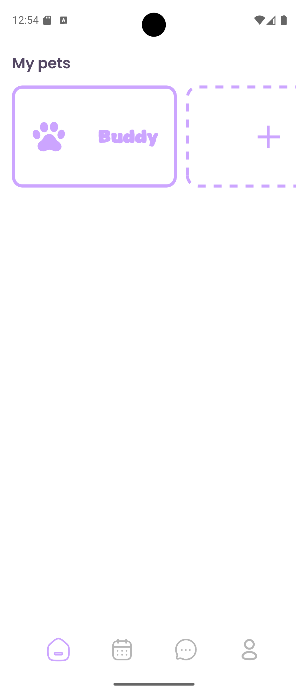
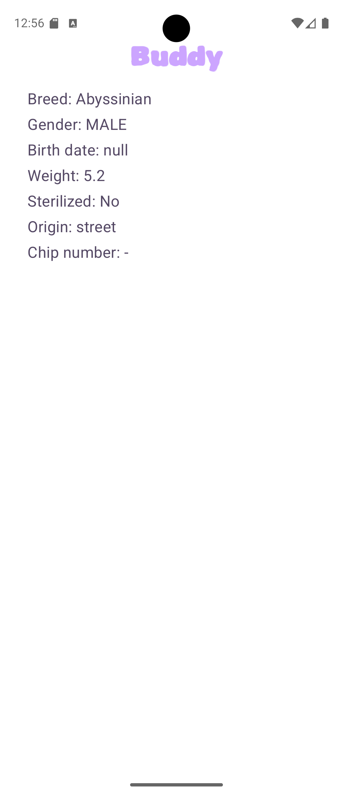

# Tailored Care 🐾

**Tailored Care** is an Android application currently in development for an imaginary veterinary clinic, designed to manage patient records and streamline interaction between the clinic and pet owners.

At its core, the app focuses on creating and storing digital medical cards animal patients, with plans to expand into veterinary search and appointment booking within the clinic ecosystem..

## Project Status

At the moment, users can add a pet with all relevant information and view this information later.

User authorization is not yet implemented. Currently, the app creates a default user automatically.

## Screenshots

<table>
  <tr>
    <td></td>
    <td></td>
    <td></td>
    <td></td>    
    <td></td>    
  </tr>
</table>

## Planned Features

- Create a medical card for a pet
- Search for nearby doctors
- View veterinarian profiles
- Book appointments directly from the app
- Extended medical history tracking

## Tech Stack

- Kotlin
- Coroutines
- Jetpack Compose
- Room
- Coil
